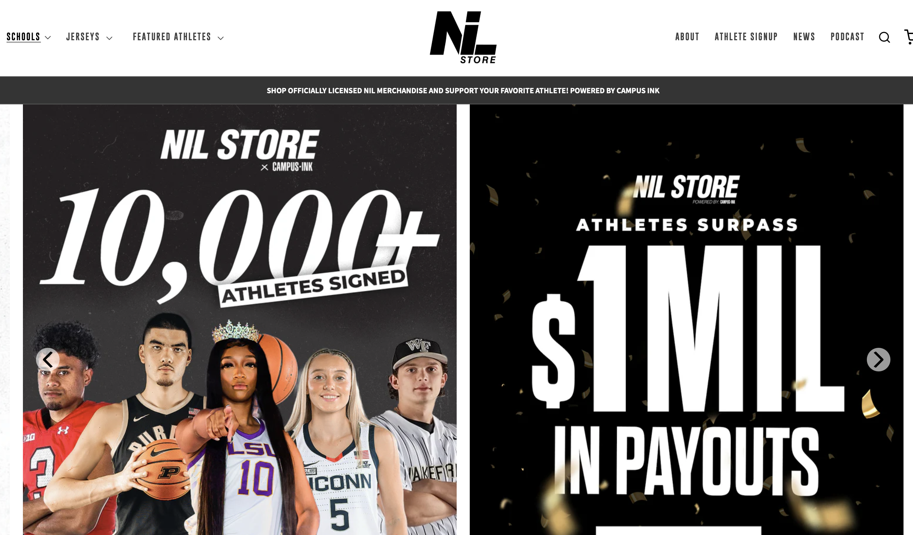

# Schools, teams, gender, athletes and products on nil.store: An analysis of NIL data for college athletes

### AKA, someone really needs to redesign this website.

### By Hannah Rosenberger

```{r setup, include=FALSE}
knitr::opts_chunk$set(echo = TRUE)
```

<div style="text-align: center;">
  
</div>

In light of the NCAA's recent agreement that Power 5 conference schools may be able to directly pay their student athletes for the first time, athlete compensation and Name-Image-Likeness initiatives will only continue to be at the forefront of the college athletics conversation. In addition to contracts with individual businesses, screenprinting companies like https://nil.store offer an opportunity for primarily Division 1 athletes across sports to quickly and directly profit from NIL merchandise. 

With more than 350 Division 1 schools and 190,000 participating athletes in the United States, The site does not represent the total NIL apparel market for college athletes. Many of the most prominent names in the NIL conversation outside of specifically merchandise, like former UNC women's basketball player Deja Kelly and LSU gymnast Olivia Dunne, aren't on the website. Particularly for larger conferences (like the SEC, which is only represented on the site by 7 of its 14 member schools), more well-endowed programs (like Duke University, which falls far below its athletic competitors in athlete participation on the site), or more well-established named (like Kelly and Dunne), external sites like nil.store may not be necessary for these programs to wrangle deals for their athletes. 

However, with more than 10,000 athletes currently represented across 65 schools (with 3 more soon to be added), there is large potential for business and a huge network of promotional product for these athletes. A site like nil.store could also be an opportunity for athletes in less funded sports (like swimming, for example) to enhance their NIL brand without the need for a direct company deal. In this way, composite online stores like the nil.store site can amass a large online marketplace with hundreds of thousands of products. 

In this project, I will analyze the schools, athletes, genders, and sports more represented on nil.store, as well as what products are most common and how pricing varies between the above categories. Depending on my findings throughout the rest of the week, I can imagine several different stories that my output data could lead me to. 

## Key Findings 

<iframe title="More than 10,000 athletes across 65 schools involved in NIL on nil.store" aria-label="Map" id="datawrapper-chart-8CAGH" src="https://datawrapper.dwcdn.net/8CAGH/2/" scrolling="no" frameborder="0" style="width: 0; min-width: 100% !important; border: none;" height="601" data-external="1"></iframe><script type="text/javascript">!function(){"use strict";window.addEventListener("message",(function(a){if(void 0!==a.data["datawrapper-height"]){var e=document.querySelectorAll("iframe");for(var t in a.data["datawrapper-height"])for(var r=0;r<e.length;r++)if(e[r].contentWindow===a.source){var i=a.data["datawrapper-height"][t]+"px";e[r].style.height=i}}}))}();
</script>

#### 1. Schools 
Ohio State has the largest amount of student-athletes represented on the site with almost 600, with UConn and Boise State rounding out the top three with 376 and 313 athletes, respectively. [Click for more.](#schools)

#### 2. Gender Balance 
There are more women's teams than men's represented on nil.store, across the 65 schools on the site. However, there are significantly more individual male athletes on the site than women. [Click for more.](#gender)

#### 3. Sports
Football was overwhelmingly the largest sport represented on the site, with more than double the number of athletes of the number 2 sport, basketball. The third-largest sport overall on the site was baseball; however, if you break the teams down by gender, the top sports shift to 1) football 2) baseball 3) women's soccer. [Click for more.](#sports)

#### 4. Conferences and Public/Private Schools
The Big 10 Conference had the most athlete participation, with more than 2300 athletes across 10 schools. There were also about 2.5 times more public schools represented on the site than private schools. [Click for more.](#conferences)

#### 5. Future Work: Products and Prices 
For each of the more than 10,000 athletes on the site, there can dozens of product options that vary in price, type, and quantity between athletes, schools and sports. That is data ripe for analysis within the context of my promotional products-based internship. [Click for more.](#products)

#### Let's get into it! 

```{r cars}
library(httr)
library(rvest)
library(dplyr)
library(tidyverse)
library(stringr)
```

## Part 1

### School-level data

First, I had to scrape the main website page to get the base url for each school's page. I used an adapted version of code from Rob and Aiden to do this. 

This process involved reading the html of the main site to look for the specific css selector that identified a school's name with its specific url. 

```{r}
# URL of the website to scrape
fullurl <- 'https://nil.store/'

# Fetch the webpage content
response <- GET(fullurl)
html_content <- content(response, as = "text")

# Parse the HTML content using rvest
soup <- read_html(html_content)

# Find the specific div containing the school names and URLs
schools_nav <- html_node(soup, css = "div.mega_menu_main#schools-nav")

# Check if the element is found
if (!is.null(schools_nav)) {
  # Find all the list items within this div
  school_list_items <- html_nodes(schools_nav, css = "li.only_link")
  
  # Extract the school names and URLs from the list items
  schools <- lapply(school_list_items, function(item) {
    link <- html_node(item, "a")
    if (!is.null(link)) {
      school_name <- html_text(link, trim = TRUE)
      school_url <- trimws(html_attr(link, "href"))
      list(name = school_name, url = school_url)
    }
  })
  
  # Filter out NULL values
  schools <- Filter(Negate(is.null), schools)
  
  # Create a data frame from the extracted data
  schools_df <- do.call(rbind, lapply(schools, as.data.frame)) %>%
    as.data.frame(stringsAsFactors = FALSE)
  
head(schools_df)
}
```

There were a few issues with that resulting list, including a few schools that didn't load properly because their urls were weird or because their stores weren't active yet, so I removed those here. 

```{r}
#The one URL was wonky, so I had to fix it. 
  schools_df[68, 2] = "https://xavier.nil.store"
  
schools_df_2 <- schools_df %>%
  slice(-59, -25, -18)
```

Using that dataframe, I was able to scrape the "Athletes" header menu for the names of all of the participating athletes and the schools they were attached to. 

```{r}
# Initialize a list to store the results
scraped_results <- list()

# Iterate over each row in the data frame
for (i in 1:nrow(schools_df_2)) {
  name <- schools_df_2$name[i]
  url <- trimws(schools_df_2$url[i])  # Remove any leading/trailing spaces
  webpage <- read_html(url)
  scraped_data <- html_text(html_nodes(webpage, xpath = "//div[contains(@class, 'nested-mobile-menu-heading-container') and contains(@class, 'athlete')]//following-sibling::div[@class='nested-mobile-menu']//li[@class='only_link']//a[@class='color-text']"), trim = TRUE)
  scraped_results[[i]] <- list(name = name, url = url, data = scraped_data)
}

# Combine the list of results into a single data frame
scraped_results_df <- bind_rows(scraped_results)

# Print the results
head(scraped_results_df)
```

<a id="schools"></a>

This dataframe then allowed me to do some preliminary analysis based on the number of athletes associated with each school. 

```{r}
by_school <- scraped_results_df %>%
  group_by(name) %>%
  summarize(
    athletes = n()) %>%
  arrange(desc(athletes))
```

<iframe title="Top 10 schools by number of athletes on nil.store" aria-label="Bar Chart" id="datawrapper-chart-UYLwq" src="https://datawrapper.dwcdn.net/UYLwq/1/" scrolling="no" frameborder="0" style="width: 0; min-width: 100% !important; border: none;" height="447" data-external="1"></iframe><script type="text/javascript">!function(){"use strict";window.addEventListener("message",(function(a){if(void 0!==a.data["datawrapper-height"]){var e=document.querySelectorAll("iframe");for(var t in a.data["datawrapper-height"])for(var r=0;r<e.length;r++)if(e[r].contentWindow===a.source){var i=a.data["datawrapper-height"][t]+"px";e[r].style.height=i}}}))}();
</script>

Ohio State, for example, had the most athletes represented, with almost 600, followed by UConn, Boise State, North Carolina and Purdue. Kansas had the lowest number of athletes, with less than 50 (about half of their next closest school).

<a id="conferences"></a>

Then, to add in some additional information about each school, I extracted a data table from Wikipedia about the NCAA's Division 1 partner schools. By adapting and joining this information to my existing dataframe, I was able to start to get a bigger picture about the website. 

```{r}
ncaa_url <- "https://en.wikipedia.org/wiki/List_of_NCAA_Division_I_institutions"

division1 <- read_html(ncaa_url) 

ncaa_tables <- division1 %>% 
  html_table(fill = TRUE)

# Display the number of tables extracted
length(ncaa_tables)

# The Wikipedia page had several tables, so I displayed the headers of each to determine which one I wanted — the second. 

my_ncaa_table <- ncaa_tables[[2]]

colnames(my_ncaa_table) <- c("School", "Common Name", "Nickname", "City","State", "Type", "Subdivision", "Primary")
colnames(by_school)<- c("Common Name","Number_Athletes")

my_ncaa_table <- my_ncaa_table %>%
  slice(-1)

#Cleaning Before Join
my_ncaa_table[25,2] = "California Baptist"
my_ncaa_table[63,2] = "ETSU"
my_ncaa_table[69,2] = "FGCU"
my_ncaa_table[280,2]= "Mizzou"
my_ncaa_table[304,2]= "Pitt"
my_ncaa_table[179,2]="SDSU"

# Left join
full_school_info <- left_join(by_school, my_ncaa_table, by = "Common Name") 

full_school_info$Primary <- gsub("\\[.*?\\]", "", full_school_info$Primary)
full_school_info$City <- gsub("\\[.*?\\]", "", full_school_info$City)
full_school_info$School <- gsub("\\[.*?\\]", "", full_school_info$School)
full_school_info$Type <- gsub("\\[.*?\\]", "", full_school_info$Type)

head(full_school_info)
```

For example, I was able to break down the participating schools by state, public or private status, and athletic conference.

<iframe title="Ohio in top spot for NIL athlete representation on nil.store" aria-label="Map" id="datawrapper-chart-HE9id" src="https://datawrapper.dwcdn.net/HE9id/1/" scrolling="no" frameborder="0" style="width: 0; min-width: 100% !important; border: none;" height="506" data-external="1"></iframe><script type="text/javascript">!function(){"use strict";window.addEventListener("message",(function(a){if(void 0!==a.data["datawrapper-height"]){var e=document.querySelectorAll("iframe");for(var t in a.data["datawrapper-height"])for(var r=0;r<e.length;r++)if(e[r].contentWindow===a.source){var i=a.data["datawrapper-height"][t]+"px";e[r].style.height=i}}}))}();
</script>

At the state level, Pennsylvania, Ohio, North Carolina and California were the states with the most schools represented on the website, and with the most athletes represented on the website.

```{r}
states <- full_school_info %>%
  select("School","Common Name", "Number_Athletes", "State") 

states_compared <- states %>%
  group_by(State) %>%
  summarise(
    number_of_schools = n(),
    total_athletes = sum(Number_Athletes)) %>%
  arrange(desc(total_athletes))

head(states_compared)
```

Next, I looked at public vs. private schools. I was curious to see this disparity because I wondered if private schools would be less represented in the NIL world because they have more endowment funding to pass on to their athletes, if not directly in NIL deals than with amenities on campus or prominent donors to connect with. Private schools are also less commonly "big sports schools," I think. 

I was correct that there were far fewer private schools represented on this list, and they also had fewer athletes per school, on average. 

```{r}
pubpriv <- full_school_info %>%
  select("School","Common Name", "Number_Athletes", "Type")

pubpriv_compared <- pubpriv %>%
  group_by(Type) %>%
  summarise(
    number_of_schools = n(),
    total_athletes = sum(Number_Athletes),
    athletes_per_school = total_athletes %/% number_of_schools
    )

print(pubpriv_compared)
```

<iframe title="More than 10,000 athletes across 65 schools involved in NIL on nil.store (Copy)" aria-label="Map" id="datawrapper-chart-yFDjP" src="https://datawrapper.dwcdn.net/yFDjP/1/" scrolling="no" frameborder="0" style="width: 0; min-width: 100% !important; border: none;" height="580" data-external="1"></iframe><script type="text/javascript">!function(){"use strict";window.addEventListener("message",(function(a){if(void 0!==a.data["datawrapper-height"]){var e=document.querySelectorAll("iframe");for(var t in a.data["datawrapper-height"])for(var r=0;r<e.length;r++)if(e[r].contentWindow===a.source){var i=a.data["datawrapper-height"][t]+"px";e[r].style.height=i}}}))}());
</script>

Next, I looked at athletic conferences. I expected that the larger athletic conferences would be on top, and I was correct, but I was surprised that the Southeastern Conference (SEC) wasn't on top. The University of Arkansas is the only SEC school to be in the top 10 on the site for number of athletes. 

I suspect that's because only half of their 14 schools are represented on the site, despite being extremely prominent in the world of college athletics. I wondered if especially large schools like Alabama, like private schools, didn't need the additional NIL support of an external site like nil.store. I'm not quite sure how I would determine that. 

The Big Ten and the ACC were the conferences with both the highest number of schools represented (10 each) and the highest number of athletes participating (3,232 and 1,690, respectively).

```{r}
conferences <- full_school_info %>%
  select("School","Common Name", "Number_Athletes", "Subdivision", "Primary")

conferences_compared <- conferences %>%
  group_by(Primary) %>%
  summarise(
    number_of_schools = n(),
    total_athletes = sum(Number_Athletes)
    ) %>%
  arrange(desc(total_athletes))

head(conferences_compared)
```

Because the data was there, I also decided to compare by subdivision — the Football Bowl Subdision, the Football Championship Subdivision, and non-Football schools. 

I suspected that FBS schools — which are the major conference schools — would have more participation because sports were more funded and popular at their institutions, and I was correct. However, I was surprised that slightly more non-football schools were on the site than FCS members. 

```{r}
subdivision1 <- full_school_info %>%
  select("School","Common Name", "Number_Athletes", "Subdivision")

subdivision_compared <- subdivision1 %>%
  group_by(Subdivision) %>%
  summarise(
    number_of_schools = n(),
    total_athletes = sum(Number_Athletes)
    )

print(subdivision_compared)
```

## Part 2

### The URL Fight 

At this point, I got stuck in a very convoluted process of trying to determine how to loop any other data from the website. Whoever designed this site did not quite (read:at all) maintain a consistent style in their web design, so it was difficult to extract either the urls for each team's page or for each athlete's page. 

This was a necessary next step because of the drop-down style setup of each page; I had to go through each level (first school, then team, then athlete, or first school, then athlete) to locate information about each athlete's products, or information about the specific sports more represented in the NIL market. 

First, using the urls that we pulled in step one, I (semi-accidentally) scraped every single menu header on every single school's page, and its corresponding url ending. It doesn't have a particularly accurate name because that's not what I thought it was going to do, but we move along!

[Click here](#gender) to skip to the analysis of gender and sport data. 

```{r}
# Initialize a list to store the results
gender_sport <- list()

for (i in 1:nrow(schools_df_2)) {
  name <- schools_df_2$name[i]
  url <- trimws(schools_df_2$url[i])  # Remove any leading/trailing spaces
  webpage <- read_html(url)
  scraped_data <- html_text(html_nodes(webpage, xpath= "//div[@class='nested-mobile-menu']//li//a[@class='color-text']/@href"))
  gender_sport[[i]] <- list(name = name, url = url, data = scraped_data)
}

# Combine the list of results into a single data frame
gender_sport_df <- bind_rows(gender_sport)
  
# Print the results
head(gender_sport_df)
```
My next task was combining all of the base urls with the sub-menu headings, to produce a list of web values that I could scrape further. However, this process was slightly complicated by the fact that at each school, not every sub-menu attached to the full base url. In the case of the University of Arkansas, shown in the header above, it attached no problem if you removed either the ending / of the base url or the beginning / of the sub-menu heading. 

However, some schools had longer base urls that didn't translate to their sub-menu urls. For example, these urls from Baylor didn't need the "/pages/baylor" part of the base url. 

```{r}
print(gender_sport_df[590:595,])

```

With that in mind, I joined the two pieces like this: 
 
```{r}
# Define a function to extract the desired portion of the URL
extract_url <- function(url, data) {
  parts <- unlist(strsplit(url, "/"))
  combined_url <- paste(parts[1:3], collapse = "/")
  return(paste0(combined_url, data))
}

# Apply the function to the 'url' column using mutate and rowwise
gender_sport_df <- gender_sport_df %>%
  rowwise() %>%
  mutate(combined_url = extract_url(url, data))

head(gender_sport_df)
```

This produced an additional column with all the the team page sub-urls, the athlete page sub-urls, and a bunch of other random ones that I then had to remove by a long and tedious process.
 
```{r}
gender_sport_df <- gender_sport_df %>% filter(
    !grepl("shop-by-sport$", combined_url) & 
      !grepl("jerseys", combined_url) & 
      !grepl("jersey", combined_url) & 
      !grepl("sports", combined_url) & 
      !grepl("onit-trading-card", combined_url) & 
      !grepl("exclusive-drops", combined_url) & 
      !grepl("postseason-apparel", combined_url) & 
      !grepl("limited-releases", combined_url) & 
      !grepl("limited-release", combined_url) & 
      !grepl("trading-cards", combined_url) &
      !grepl("bulldog-initiative", combined_url) &
      !grepl("legacy", combined_url) & 
      !grepl("tees", combined_url) &
      !grepl("dawg-mentality-collection", combined_url) &
      !grepl("big-red-helmet-collection", combined_url) &
      !grepl("future", combined_url) &
      !grepl("releases", combined_url) &
      !grepl("volleyball-day", combined_url) &
      !grepl("jackets", combined_url) &
      !grepl("locker-room", combined_url) &
      !grepl("legacy", combined_url) &
      !grepl("merch", combined_url) &
      !grepl("coming-soon", combined_url) &
      !grepl("https://nil.shop/search", combined_url) &
      !grepl("collective", combined_url) &
      !grepl("search", combined_url) &
      !grepl("champions", combined_url) &
       !grepl("shirseys", combined_url) &
       !grepl("https://nil.store/pages/pitt/", combined_url) &
       !grepl("champion", combined_url) &
       !grepl("four", combined_url) &
       !grepl("eight", combined_url) &
      !grepl("sixteen", combined_url) &
      !grepl("stop", combined_url) &
      !grepl("apparel", combined_url) &
      !grepl("raglan", combined_url) &
      !grepl("https://nil.store/pages/baylor/pages/baylor", combined_url) &
      url!= combined_url &
      substr(combined_url, nchar(combined_url), nchar(combined_url)) != "/" &
      substr(combined_url, nchar(combined_url), nchar(combined_url)) != "#"
      )
```

I was then left with the problem of how to split the remaining values in the dataframe into sport pages and athlete pages, as the code for scraping each of those would be different things. I was able to scrape the sport page urls specifically into a separate dataframe with this code. 

First for men's sports: 

```{r}
mens_sports_df <- list()

for (i in 1:nrow(schools_df_2)) {
  name <- schools_df_2$name[i]
  url <- trimws(schools_df_2$url[i])
  
  tryCatch({
    html <- read_html(url)
    mens_sports <- html %>%
      html_nodes(".nested-mobile-menu li:contains(\"Men's\") li.only_link a.color-text") %>%
      html_attr("href")
    
    if (length(mens_sports) > 0) {
      mens_sports_df[[name]] <- mens_sports
    } else {
      mens_sports_df[[name]] <- NA
    }
  }, error = function(e) {
    mens_sports_df[[name]] <- NA
    warning(paste("Error occurred for", name, ":", e$message))
  })
}

# Unpack the list column and convert to a DataFrame
mens_sports_df <- mens_sports_df %>%
  enframe(name = "name", value = "mens_sports") %>%
  unnest(mens_sports)

# Join with the schools_df_2 DataFrame to include the base URL
mens_sports_df <- mens_sports_df %>%
  left_join(schools_df_2, by = "name") %>%
  mutate(gender = "Men's")

# Print the resulting DataFrame
head(mens_sports_df)
```

And then for Women's:

```{r}
womens_sports_df <- list()

for (i in 1:nrow(schools_df_2)) {
  name <- schools_df_2$name[i]
  url <- trimws(schools_df_2$url[i])
  
  tryCatch({
    html <- read_html(url)
    womens_sports <- html %>%
      html_nodes(".nested-mobile-menu li:contains(\"Women's\") li.only_link a.color-text") %>%
      html_attr("href")
    
    if (length(mens_sports) > 0) {
      womens_sports_df[[name]] <- womens_sports
    } else {
      womens_sports_df[[name]] <- NA
    }
  }, error = function(e) {
    womens_sports_df[[name]] <- NA
    warning(paste("Error occurred for", name, ":", e$message))
  })
}

# Unpack the list column and convert to a DataFrame
womens_sports_df <- womens_sports_df %>%
  enframe(name = "name", value = "womens_sports") %>%
  unnest(womens_sports) 

# Join with the schools_df_2 DataFrame to include the base URL
womens_sports_df <- womens_sports_df %>%
  left_join(schools_df_2, by = "name") %>%
  mutate(gender = "Women's")

# Print the resulting DataFrame
head(womens_sports_df)
```

Then, I joined them, changing the column names for consistency and adding a column to clarify Men's or Women's: 

```{r}
colnames(mens_sports_df) <- c("school", "sport_url", "main_url", "gender")
colnames(womens_sports_df) <- c("school", "sport_url", "main_url", "gender")


# Join the men's and women's sports DataFrames and add a gender column
all_sports_df <- bind_rows(
  mens_sports_df %>% mutate(gender = "Men's"),
  womens_sports_df %>% mutate(gender = "Women's")
)

# Print the resulting DataFrame
head(all_sports_df)
```

Then, similarly to what I did with my mega database, the urls to create a new column with the full urls for each team's page. 

```{r}

# Define a function to extract the desired portion of the URL
extract_url <- function(main_url, sport_url) {
  parts <- unlist(strsplit(main_url, "/"))
  combined_url <- paste(parts[1:3], collapse = "/")
  return(paste0(combined_url, sport_url))
}

# Apply the function to the 'url' column using mutate and rowwise
all_sport_pages <- all_sports_df %>%
  rowwise() %>%
  mutate(combined_url = extract_url(main_url, sport_url))

# Print the updated dataframe
head(all_sport_pages)
```

Then, it was time to continue scraping in order to obtain more information about the specific sports under each school, and the number of athletes under each of those sports. 

```{r include=FALSE}

# sport_and_athlete_df <- list()
# for (i in 1:nrow(all_sport_pages)) {
#   school <- all_sport_pages$school[i]
#   url <- trimws(all_sport_pages$combined_url[i])
#   
#   tryCatch({
#     html <- read_html(url)
#     
#     # Extract sport from page title (assuming it's in the format "Sport - School Name")
#     sport <- html %>%
#       html_element("title") %>%
#       html_text() %>%
#       str_extract("^[^-]+") %>%
#       str_trim()
#     
#     athletes <- html %>%
#       html_elements(".card__heading a") %>%
#       html_text() 
#     
#     if (length(athletes) > 0) {
#       sport_and_athlete_df[[i]] <- tibble(school = school, gender = gender, sport = sport, athlete = athletes)
#     } else {
#       sport_and_athlete_df[[i]] <- tibble(school = school, gender = gender, sport = sport, athlete = NA_character_)
#     }
#   }, error = function(e) {
#     sport_and_athlete_df[[i]] <- tibble(school = school, sport = NA_character_, athlete = NA_character_)
#     warning(paste("Error occurred for", school, ":", e$message))
#   })
# }
# 
# # Combine all tibbles into a single dataframe
# sport_and_athlete_df <- bind_rows(sport_and_athlete_df)
```

This dataset was effective, but a bit messy, with duplicates, odd formatting and other quirks, such as the Boise State Men's Cross Country Team being linked on the Belmont University page. It required a good bit of cleaning to get it usable.

```{r}
# 
# sport_and_athlete_df_cleaned <- sport_and_athlete_df %>%
#   mutate(school = case_when(
#     school == "Belmont" & sport == "Boise State Men's Cross Country\n – NIL Store" ~ "Boise State",
#     school == "Belmont" & sport == "Boise State Women's Cross Country\n – NIL Store" ~ "Boise State",
#     TRUE ~ school
#   ))
```

```{r}
# sport_and_athlete_df_cleaned <- sport_and_athlete_df_cleaned %>%
#   # Clean up the sport column (keep this part as it was)
#   mutate(
#     sport = str_extract(sport, "^[^–—-]+"),  # Get text before "-", "–", or "—"
#     sport = str_remove_all(sport, "Men's|Women's"),  # Remove "Men's" or "Women's"
#     sport = str_remove_all(sport, school),  # Remove school name
#     sport = str_trim(sport)  # Trim whitespace
#   ) %>%
#   # Clean up the athlete column (updated part)
#   mutate(
#     athlete = str_remove(athlete, "\\|.*"),  # Remove "|" and everything after
#     athlete = str_remove_all(athlete, "#\\d+"),  # Remove "#" followed by digits
#     athlete = str_remove_all(athlete, "\\d+"),  # Remove all digits
#     athlete = str_remove_all(athlete, "[#]"),  # Remove any remaining "#"
#     athlete = str_trim(athlete),  # Trim whitespace
#     athlete = str_squish(athlete)  # Replace multiple spaces with a single space
#   ) %>%
#   # Remove "Sign Up Now!" and duplicates (keep this part as it was)
#   filter(
#     athlete != "Sign Up Now!"
#   ) %>%
#   # Optional: arrange by school and sport for readability
#   arrange(school, sport) %>%
#   select(gender, everything())%>%
#   # Remove duplicates based on athlete column only
#   distinct(athlete, .keep_all = TRUE)
# 
# 
# sport_and_athlete_df_cleaned <- sport_and_athlete_df_cleaned %>%
#   mutate(
#     sport = case_when(
#       school == "California Baptist" ~ str_remove(sport, "CBU "),
#       school == "Stephen F. Austin" ~ str_remove(sport, "SFA "),
#       TRUE ~ sport
#     )
#   )
# 
# # Check the unique characters in the "sport" column
# unique_chars <- unique(sport_and_athlete_df_cleaned$sport)
# 
# sport_and_athlete_df_cleaned <- sport_and_athlete_df_cleaned %>%
#   mutate(sport = str_trim(sport)) 

```

```{r}

# sport_and_athlete_df_cleaned <- sport_and_athlete_df_cleaned %>%
#   mutate(sport = case_when(
#     sport %in% c("Ladybirds", "Dance Team", "Dancing") ~ "Dance",
#     sport %in% c("Cheerleading", "Spirit", "Stunt") ~ "Cheerleading",
#     sport %in% c("Swim & Dive", "Swim and Dive", "Swimming", "Swimming & Diving") ~ "Swim and Dive",
#     TRUE ~ sport
#   ))
```

This resulted in a dataframe that specifically listed out all of the athletes listed under the team's rosters on the site. This meant that some athletes who were listed on the main school "athlete" menu — the list obtained much earlier in the process — but not on a roster were excluded from the final data. 

Based on some Googling, I believe this often indicated that those athletes who were listed on the main school "athlete" dropdown, but not on an individual sport page were injured or transferring. As I couldn't figure out how to re-incorporate them back into the data, this section focuses specifically on those athletes on active rosters. 

## Part 3

#### Sport and Gender breakdowns. 

<a id="sports"></a>

This is where this gets interesting. 

<iframe title="Football players make up more than a quarter of nil.store" aria-label="Election Donut" id="datawrapper-chart-ZQlGy" src="https://datawrapper.dwcdn.net/ZQlGy/1/" scrolling="no" frameborder="0" style="width: 0; min-width: 100% !important; border: none;" height="598" data-external="1"></iframe><script type="text/javascript">!function(){"use strict";window.addEventListener("message",(function(a){if(void 0!==a.data["datawrapper-height"]){var e=document.querySelectorAll("iframe");for(var t in a.data["datawrapper-height"])for(var r=0;r<e.length;r++)if(e[r].contentWindow===a.source){var i=a.data["datawrapper-height"][t]+"px";e[r].style.height=i}}}))}();
</script>

Looking sport by sport, football is overwhelmingly the biggest sport represented on the site, with basketball and baseball combining in spots two and three to not-quite equal the football numbers. 
 
```{r}
# sports_participants <- sport_and_athlete_df_cleaned %>%
#   group_by(sport) %>%
#   summarize(
#     number_athletes = n()
#   ) %>%
#   arrange(desc(number_athletes))
# 
# head(sports_participants)
```
As a fun aside: some interesting (and perhaps surprising!) sports contained in the "other" category include: 

Fencing, with 52 athletes

Equestrian, with 16 athletes

Bowling, with 10 athletes

Rifle, with 10 athletes

Triathlon, with 8 athletes

and Squash, with 2 athletes!

<a id="gender"></a>

However, when you split it up by individual men's / women's team, football (and baseball, to a lesser degree) still dominate the rankings for most athletes featured on the site — but the other sports shift around. 

<iframe title="By individual team sports, women's soccer replaces basketball at number 3 spot" aria-label="Table" id="datawrapper-chart-ZtiP8" src="https://datawrapper.dwcdn.net/ZtiP8/1/" scrolling="no" frameborder="0" style="width: 0; min-width: 100% !important; border: none;" height="470" data-external="1"></iframe><script type="text/javascript">!function(){"use strict";window.addEventListener("message",(function(a){if(void 0!==a.data["datawrapper-height"]){var e=document.querySelectorAll("iframe");for(var t in a.data["datawrapper-height"])for(var r=0;r<e.length;r++)if(e[r].contentWindow===a.source){var i=a.data["datawrapper-height"][t]+"px";e[r].style.height=i}}}))}();
</script>

```{r}
# mens_womens <- sport_and_athlete_df_cleaned %>%
#   group_by(sport, gender) %>%
#   summarize (
#     number_athletes = n() 
#   ) %>%
#   arrange(desc(number_athletes))
```
Looking at this data from a broader lens, of the more than 10,000 athletes on the site, more than 60% of them are male. However, it's close to 60% of the female **teams** that make up the site. 

There are about 6200 male athletes, but only 383 teams, representing an average of about 16 athletes per team. However, there are only about 3800 female athletes, but almost 500 teams, an average of about 8 athletes per team on the site. Obviously, not every athlete on every team has chosen to market themselves on nil.store, but the higher male athlete per team ration can likely be explained by the large sizes of football and baseball teams in general, and the large numbers of those athletes on the site. The Wake Forest football team alone, for example, has more than 100 athletes featured on its nil.store page. 

<iframe title="More male athletes than female athletes are using nil.store, but more women's teams are represented" aria-label="Multiple Pies" id="datawrapper-chart-EqaEU" src="https://datawrapper.dwcdn.net/EqaEU/1/" scrolling="no" frameborder="0" style="width: 0; min-width: 100% !important; border: none;" height="417" data-external="1"></iframe><script type="text/javascript">!function(){"use strict";window.addEventListener("message",(function(a){if(void 0!==a.data["datawrapper-height"]){var e=document.querySelectorAll("iframe");for(var t in a.data["datawrapper-height"])for(var r=0;r<e.length;r++)if(e[r].contentWindow===a.source){var i=a.data["datawrapper-height"][t]+"px";e[r].style.height=i}}}))}();
</script>

#### Other Tables

I made these tables to explore the data and look for interesting patterns like this one.

This determined the number of male and female athletes on the site. 
```{r}
# by_gender <- sport_and_athlete_df_cleaned %>%
#   group_by(gender) %>%
#   summarize(
#     number_athletes = n()
#   )
# 
# print(by_gender)
```

This determined the number of men's and women's teams on the site.
```{r}
gender_teams <- all_sport_pages %>%
  group_by(gender) %>%
  summarize(
    number_athletes = n()
  )

print(gender_teams)
```

This created a dataframe with the number of male athletes, the number of female athletes, and the number of total athletes for each school's site. 

```{r}
# by_team <- sport_and_athlete_df_cleaned %>%
#   group_by(school, gender) %>%
#   summarize(
#     number_athletes = n()
#   ) %>%
#   pivot_wider(names_from = gender, 
#               values_from = number_athletes) %>%
#   rename(
#     mens_athletes = `Men's`,
#     womens_athletes = `Women's`
#   ) %>%
#   mutate(
#     total_athletes = sum(mens_athletes + womens_athletes)
#   )
# 
# head(by_team)
```

Similarly, this created a dataframe with the number of men's teams, the number of women's teams, and the total number of teams for each school's site. 

```{r}
team_gender_schools <- all_sport_pages %>%
  group_by(school, gender) %>%
  summarize(
    number_teams = n()
  ) %>%
  pivot_wider(names_from = gender, 
              values_from = number_teams) %>%
  rename(
    mens_teams = `Men's`,
    womens_teams = `Women's`
  ) %>%
  mutate(
    total_teams = sum(mens_teams + womens_teams)
  )

head(team_gender_schools)
```

Finally, this dataframe displays the number of athletes on each team, at each school. I think there is useful information to come from this one in particular — how many schools have baseball teams, for example, or what the team with the highest number of athletes is (that isn't football). However, the number of teams on this list is slighly less than the number in my other teams databases, so I'm unsure what got lost in translation. 

```{r}
# individual_teams <- sport_and_athlete_df_cleaned %>%
#   group_by(sport, gender, school) %>%
#   summarize(
#     number_athletes = n()
#   )  %>%
#   arrange(desc(number_athletes))
# 
# head(individual_teams)
```

## Part 4

### Products and Prices

<a id="products"></a>

Due to the many complications of scraping, I didn't have as much time to work with this data as I would have liked. However, I did develop code that works for scraping the full product list of one school, and all of its athletes (I think). Hopefully, that can be adapted to eventually scrape the full website, but for now, this works for a demonstration. 

First, using the dataframe with the full list of team urls, I created a list of athlete urls with all of the values from the gender_sport_df table that were NOT in the all_sport_pages table. 

```{r}
# Create the third dataframe athlete_urls
athlete_urls <- anti_join(gender_sport_df, all_sport_pages, by = "combined_url")

# View the resulting dataframe
head(athlete_urls)
```

There were still some lingering non-athlete urls, so I removed them manually. 

```{r}
# Define the row indices to be removed
rows_to_remove <- c(9907, 9662, 9574, 9516, 9463, 9384, 9328:9330, 9301, 9197, 
                    9138, 9088, 9034, 8490, 8429, 8367, 8297, 8215, 8167, 8106, 
                    7004, 5293, 5292, 5265, 5182, 3615, 3614, 3545, 3422:3424, 
                    3126:3128, 2740, 2741, 2492, 2209, 2210, 2179:2181, 2136:2141, 
                    2097, 2006, 1877, 1818, 1817, 1816, 1767, 1715, 1662, 1242, 
                    645, 578, 516, 453)

# Remove the specified rows from the dataframe
athlete_urls <- athlete_urls[-rows_to_remove, ] %>%
  distinct(combined_url, .keep_all = TRUE)

# View the resulting dataframe
head(athlete_urls)
```

For the purposes of this presentation, I chose to scrape Ohio State's page, since it has the highest number of athletes. 


This process went into each athlete's url, looked for the html information below that indicates a product and its price, and compiled them into a dataframe. 

This process also deleted duplicates, which proved helpful, as some athletes had name-specific products and some did not. This is the idea I would like to explore most moving forward into my internship, and the idea that I think that would turn into the most focused story for the outlet I'm writing for.  

```{r}
# ohio_state <- athlete_urls[athlete_urls$name == "Ohio State", ]
# 
# # Initialize an empty data frame to store the results
# ohio_state_products <- data.frame()
# 
# # Loop through rows 1-236 of athlete_urls
# for (i in 1:nrow(ohio_state)) {
#   # Read the HTML content from the URL
#   url <- ohio_state$combined_url[i]
#   webpage <- read_html(url)
#   
#   # Extract product names and prices using CSS selectors
#   product_elements <- webpage %>% html_nodes("div h3 a") %>% html_text(trim = TRUE)
#   price_elements <- webpage %>% html_nodes("span.price-item.price-item--regular") %>% html_text(trim = TRUE)
#   
#   # Select only half of the product elements to match the number of price elements
#   half_product_elements <- product_elements[seq(1, length(product_elements), by = 2)]
#   
#   # Check if the lengths of half_product_elements and price_elements are the same
#   if (length(half_product_elements) == length(price_elements)) {
#     # Combine the product names and prices into a data frame
#     products <- data.frame("Product Name" = half_product_elements, "Price" = price_elements)
#     
#     # Append the extracted data to the all_products data frame
#     ohio_state_products <- rbind(ohio_state_products, products)
#   } else {
#     warning(paste("Unequal number of product names and prices extracted from URL:", url))
#   }
# }
# 
# head(ohio_state_products)
```

```{r}
# library(tidyr)
# 
# ohio_state_clean <- ohio_state_products %>%
#   separate(Product.Name, into = c("Product", "Athlete_Name"), sep = " - ", fill = "right") %>%
#   mutate(Price = str_replace(Price, "From \\$", ""),
#          Price = str_replace(Price, "\\$", "")) %>%
#   mutate(Price = as.numeric(Price)) %>%
#   mutate(School = "Ohio State")
# 
# ohio_state_clean <- ohio_state_clean %>%
#   mutate(Type = str_extract(Product, "\\w+$")) %>%
#   mutate(Product = str_remove(Product, "\\s\\w+$")) %>%
#   select(School, Athlete_Name, Product, Type, Price)
# 
# ohio_state_clean$Product <- paste(ohio_state_clean$Product, ohio_state_clean$Type, sep = " ")
# 
# ohio_state_clean$Athlete_Name <- gsub("[^a-zA-Z ]", "", ohio_state_clean$Athlete_Name)

```

After cleaning the data a bit, you get a chart that looks a bit like this: 

<iframe title="Ohio State promotional products on nil.store" aria-label="Table" id="datawrapper-chart-67Faz" src="https://datawrapper.dwcdn.net/67Faz/1/" scrolling="no" frameborder="0" style="width: 0; min-width: 100% !important; border: none;" height="764" data-external="1"></iframe><script type="text/javascript">!function(){"use strict";window.addEventListener("message",(function(a){if(void 0!==a.data["datawrapper-height"]){var e=document.querySelectorAll("iframe");for(var t in a.data["datawrapper-height"])for(var r=0;r<e.length;r++)if(e[r].contentWindow===a.source){var i=a.data["datawrapper-height"][t]+"px";e[r].style.height=i}}}))}();
</script>

## Questions to look to now 

### 1. Do prices, number of products, or type of products differ between types of schools (conferences, big schools, public/private, etc)? 
### 2. Do prices, number of products, or type of products differ between men's and women's athletes?
### 3. Do prices, number of products, or type of products differ between sports?

Regardless of the answer to these questions, I think there's a story there. 

Thank you!


